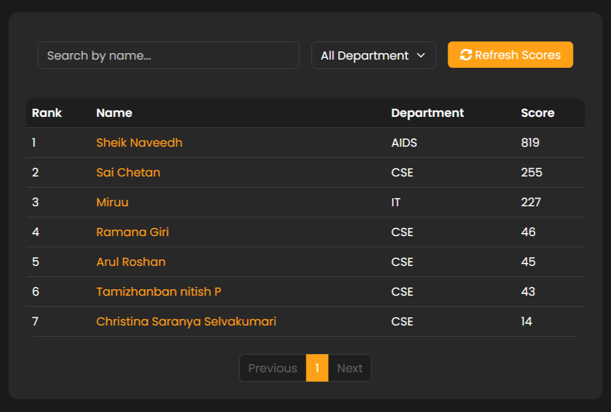
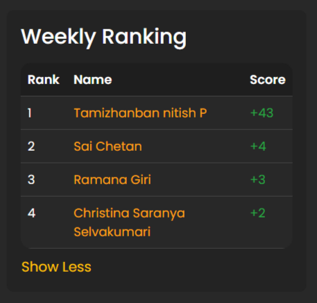

# LeetCode Leaderboard 🏆


A modern web-based leaderboard application for tracking and displaying LeetCode scores. The application provides real-time updates, filtering capabilities, and an intuitive user interface.

## 📸 Screenshots

### Main Dashboard


### Weekly Rankings


### Add New Entry


## ✨ Features

- 📊 Real-time leaderboard display with dynamic updates
- 🔍 Advanced search functionality by student name
- 🏢 Department-wise filtering (CSE, IT, AIDS)
- 📈 Weekly improvement tracking
- ➕ Streamlined submission form for new entries
- 📱 Fully responsive design for all devices
- 🎨 Modern and clean user interface with LeetCode-inspired theme
- 🔄 Automatic score refresh functionality

## 🛠️ Technologies Used

- **Frontend:**
  - HTML5
  - CSS3
  - JavaScript (ES6+)
  - Bootstrap 5.3.0
  - Google Fonts (Poppins)
  - Font Awesome Icons

- **Backend:**
  - Node.js
  - Express.js
  - RESTful API architecture

## 🚀 Getting Started

### Prerequisites

- Node.js (v14 or higher)
- npm (Node Package Manager)
- Git

### Environment Setup

1. Create a `.env` file in the root directory:
```bash
touch .env
```

2. Add the following environment variables to your `.env` file:
```env
# Server Configuration
PORT=3000

# Database Configuration
DB_USER=your_database_username
DB_PASSWORD=your_database_password
DB_HOST=localhost
DB_PORT=27017
DB_NAME=leetcode_leaderboard
```

Note: Make sure to replace the placeholder values with your actual configuration values. Never commit the `.env` file to version control.

### Installation

1. Clone the repository:
```bash
git clone [repository-url]
```

2. Navigate to the project directory:
```bash
cd leetcode-leaderboard
```

3. Install dependencies:
```bash
npm install
```

4. Start the development server:
```bash
npm run dev
```

5. Open your browser and visit `http://localhost:3000`

## 📁 Project Structure

```
leetcode-leaderboard/
├── public/
│   ├── index.html          # Main HTML file
│   ├── styles.css          # Custom styles
│   └── script.js           # Frontend JavaScript
├── server.js               # Backend server
├── package.json            # Project dependencies
├── screenshots/            # Project screenshots
└── README.md              # Project documentation
```

## 💡 Usage Guide

1. **Viewing the Leaderboard**
   - The main dashboard displays the current rankings
   - Scores are automatically updated
   - Use the refresh button to manually update scores

2. **Searching and Filtering**
   - Use the search box to find specific students
   - Filter results by department using the dropdown menu
   - Combine search and filters for precise results

3. **Adding New Entries**
   - Fill out the submission form on the right
   - Provide name, department, and LeetCode username
   - Submit to add your entry to the leaderboard

4. **Weekly Rankings**
   - View weekly improvements in the side panel
   - Click "Show More" to expand the weekly rankings
   - Track progress over time

## 🤝 Contributing

Contributions are welcome! Please feel free to submit a Pull Request. For major changes, please open an issue first to discuss what you would like to change.

1. Fork the repository
2. Create your feature branch (`git checkout -b feature/AmazingFeature`)
3. Commit your changes (`git commit -m 'Add some AmazingFeature'`)
4. Push to the branch (`git push origin feature/AmazingFeature`)
5. Open a Pull Request
